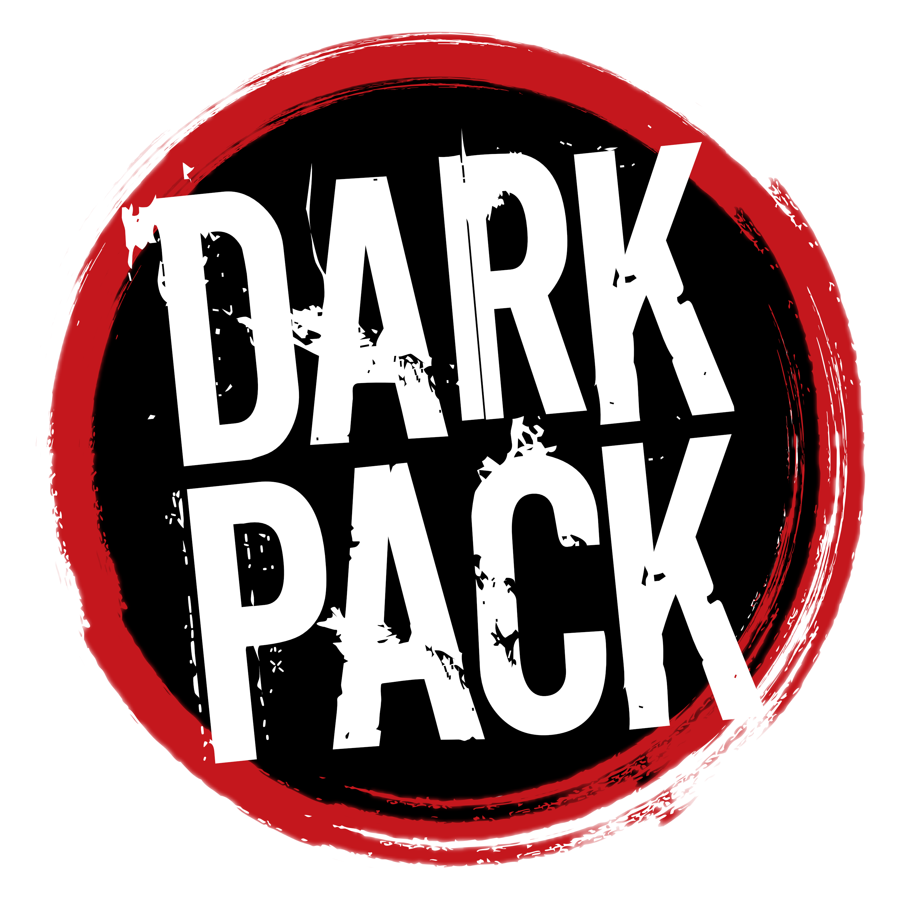

# Vampire: The Masquerade - Bloodlines Discord Theme

A BetterDiscord theme inspired by Vampire: The Masquerade – Bloodlines (2004).

> Reimagining Discord as if it had been designed by Troika Games in 2004.

## 🛡️ Dark Pack Agreement



Portions of the materials are the copyrights and trademarks of Paradox Interactive AB, and are used with permission. All rights reserved. For more information please visit [worldofdarkness.com](https://www.worldofdarkness.com/).

*This is a fan-made project and is not an official World of Darkness product.*

---

## Status

🚧 In Development

Current Version: 0.0.2 (Foundation)

## Features

- Bloodlines inspired interface
- Custom typography
- Dark gothic color palette
- Modular architecture
- BetterDiscord compatible

## Development

The theme is built using a modular architecture.

Only `Bloodlines.theme.css` should be placed inside the BetterDiscord Themes folder.

All remaining modules are loaded directly from GitHub during development.

## Project Structure

```text
.
├── README.md
├── CHANGELOG.md
│
├── Theme/
│   ├── Bloodlines.theme.css
│   │
│   ├── Variables/
│   │   ├── variables.css
│   │   ├── fonts.css
│   │   ├── colors.css
│   │   └── animations.css
│   │   └── effects.css
│   │
│   ├── Layout/
│   │   ├── app.css
│   │   ├── containers.css
│   │   └── scrollbars.css
│   │
│   ├── Guilds/
│   │   ├── guild-bar.css
│   │   ├── guild-icons.css
│   │   └── guild-home.css
│   │
│   ├── Channels/
│   │   ├── sidebar.css
│   │   ├── categories.css
│   │   └── channels.css 
│   │   └── channel-icons.css
│   │
│   ├── Chat/
│   │   ├── chat.css
│   │   ├── messages.css
│   │   ├── embeds.css
│   │   ├── markdown.css
│   │   └── textarea.css
│   │
│   ├── Members/
│   │   ├── members.css
│   │   └── member-card.css
│   │
│   ├── Profile/
│   │   ├── popout.css
│   │   └── full-profile.css
│   │
│   ├── Settings/
│   │   └── settings.css
│   │
│   ├── Context/
│   │   ├── context-menu.css
│   │   └── tooltip.css
│   │
│   ├── Pickers/
│   │   ├── emoji.css
│   │   ├── gif.css
│   │   └── stickers.css
│   │
│   ├── Voice/
│   │   └── voice.css
│   │
│   ├── DM/
│   │   ├── friends.css
│   │   └── dm.css
│   │
│   └── Utilities/
│       ├── overrides.css
│       └── fixes.css
│       └── keyframes.css
│
├── Assets/
│   ├── Fonts/
│       └── Kruella Regular.otf
│       └── Mephisto.ttf
│       └── wolfsbane2.ttf
│   ├── Icons/
│       └── forum-limited.svg
│       └── forum.svg
│       └── text-limited.svg
│       └── text.svg
│       └── voice-limited.svg
│       └── voice.svg
│   ├── Branding/
│       └── DarkPack_Logo_Color.png
│   ├── Clans/
│   ├── Sects/
│   ├── Fire/
│   ├── Smoke/
│   ├── Textures/
│   ├── Metal/
│   └── Backgrounds/
│
├── Plugins/
│   ├── Fire/
│   └── ClanIcons/
│
└── Docs/
│   └── Inspirations.md
│   └── References.md
```

## License

This project is licensed under the **MIT License**. 

*Note: This license applies only to the source code and CSS architecture created by the developer. All World of Darkness assets (clans symbols, iconography, and aesthetic elements inspired by VTM) remain the property of Paradox Interactive AB and are used under the terms of the Dark Pack Agreement.*